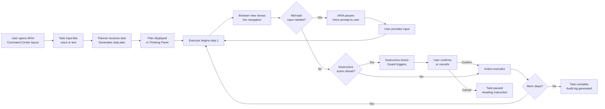
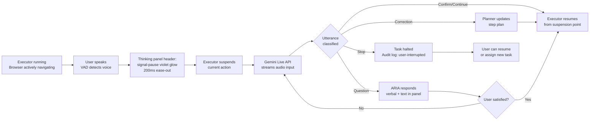
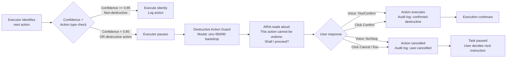

# User Journey Flows

The PRD documents six personas but confirms a single underlying capability pattern: all six are served by the same mechanics  task assignment, live execution with thinking panel, voice barge-in, destructive action guard, and audit log. Three universal interaction flows cover every journey.

### Flow 1  Core Task Execution

*Entry to completion  the spine every session follows.*
**Personas:** All six (Sara, James, Margaret, Ravi, Leila, Chris)

**Entry points:** Voice via always-on waveform mic  Text in task input bar
**Success signal:** Green `signal-done` badge on all steps + audit log tab unlocks with screenshot count
**Key UX moment:** Browser moves and thinking panel updates simultaneously  users see coordination, not just logging

---

### Flow 2  Voice Barge-in

*User speaks while agent is executing  agent stops, listens, adapts.*
**Personas:** James (correction), Ravi (stop), Sara (implicit), Leila

**Barge-in affordance:** VAD waveform always active in thinking panel  no button required to interrupt
**Visual signal:** `signal-pause` violet replaces `signal-active` blue instantly  the color change IS the acknowledgment
**Emotional goal:** User feels heard within 200ms before ARIA finishes processing

---

### Flow 3  Destructive Action Guard

*ARIA detects irreversible action and requires explicit human confirmation.*
**Personas:** Sara (submit), Margaret (submit), Leila (purchase), Chris (publish)

**Guard triggers:** Form submit, purchase/payment, publish/post, delete, send email/message, file overwrite
**Guard does NOT trigger:** Navigation, reading, searching, filling non-submit fields, scrolling
**Emotional goal:** Users know ARIA will never silently do something irreversible

---

### Journey Patterns

| Pattern | Description | Flows |
|---|---|---|
| **Suspend-Resume** | Executor suspends at any step boundary and resumes from the same point without re-executing prior steps | Barge-in (Flow 2), Mid-task input (Flow 1), Guard cancel (Flow 3) |
| **Voice-first confirmation** | Every pause that requires user input is voiced aloud AND shown in the thinking panel  dual channel reduces missed prompts | Guard (Flow 3), Mid-task input (Flow 1) |
| **Audit point injection** | Every state transition (plan-start, step-complete, user-interrupted, guard-confirmed, guard-cancelled) writes a timestamped audit record | All flows |

### Flow Optimization Principles

1. **Zero idle time on the happy path**  high confidence + non-destructive action = ARIA moves without pausing
2. **Every pause has an obvious resume**  thinking panel always shows what ARIA is waiting for and how to provide it
3. **Barge-in suspends, not stops**  voice interruption is a modification unless user explicitly says "stop"
4. **Audit log is a first-class output**  not a debug tool; it is what Sara hands her intern, what Ravi pastes into the launch ticket, what Margaret screenshots for her records

---

